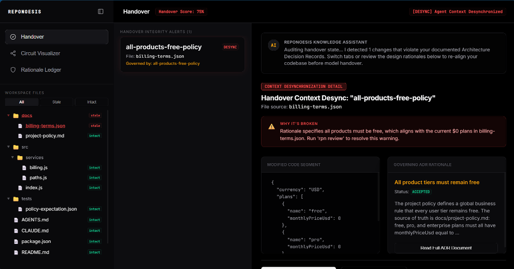
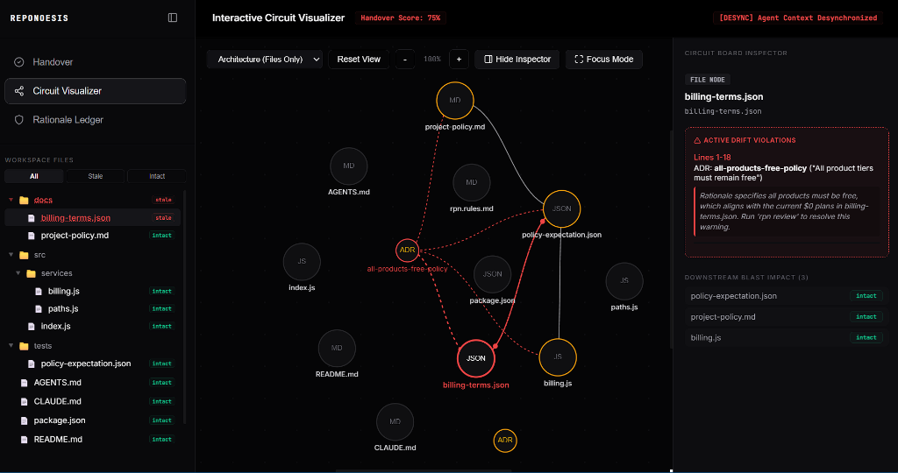
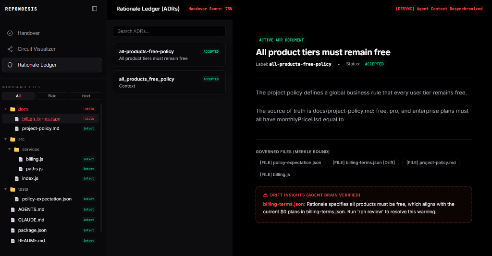

# Reponoesis (rpn)

[](https://github.com/mathewaddala/reponoesis/actions/workflows/ci.yml)

> **Semantic dependency tracking for AI-native codebases — powered by the agent's own brain.**
> When an AI agent changes one file, Reponoesis tells you — with cryptographic certainty — what else needs reviewing, and preserves the WHY for every architectural decision.

---

## The Problem

AI agents edit individual files brilliantly. They fail at cross-file semantic consistency.

```text
Agent changes billing from $50 -> $10 in pricing.tsx
-> Doesn't update terms/page.tsx       (still says "$50/month")
-> Doesn't update STORE_LISTING.md     (still says "flat $50 fee")
-> Doesn't update HomeClient.tsx       (still shows the old price in the hero)
-> Next agent opens the project -> has zero context on WHY $10 was chosen
```

This is not a bug. It's a structural gap — no tool tracks semantic dependencies across file types, and no tool preserves the WHY of architectural decisions for future agents.

## What Reponoesis Does

**1. Agent-Brain Extraction** — The AI agent (Cursor/Claude/Gemini) reads code and writes its semantic understanding back into a Merkle-anchored graph via MCP tools. No static algorithms. No regex keyword lists. The agent's intelligence IS the extractor.

**2. Concept Merkle Chain** — Every concept (`billing_model`, `auth_strategy`, `gdpr_consent`) gets SHA3-256 fingerprinted. When a file changes, the chain link invalidates deterministically — no fuzzy "maybe."

**3. Dynamic Agent Explanations** — AI agents write plain-English descriptions of drift directly to the database. These override cryptographic warnings, explaining the business logic changes verbatim in the developer interface.

**4. Offline Contradiction Engine** — Agents log conflicts between files (e.g. mismatched constants or version specs) into a local SQLite database. Pre-commit hooks gate Git commits if unresolved contradictions exist.

**5. Repo Remembrance** — ADRs (Architecture Decision Records) with full WHY rationale are stored and surfaced to new agent sessions via `rpn_get_context`. No more agent amnesia on "why did we choose X?"

## Screenshots

### 1. Handover Integrity Center (`rpn status` / `rpn review`)
View the integrity dashboard, active context desynchronization alerts, code diff mutations, and governing ADR rationale details.


### 2. Interactive Circuit Visualizer (`rpn ui`)
Every file and ADR is rendered as a package on a dark PCB board grid, displaying semantic concept connections and active drift violations as glowing trace lines.


### 3. Rationale Ledger (ADR Manager)
Browse the list of active Architectural Decision Records (ADRs), check their status, and audit governed files with agent-verified drift insights.


---

## Architecture

```text
packages/
  core/    - SQLite graph, SHA3 Merkle chain, concept indexer, agent write-back API
  cli/     - rpn init | scan | check | decide | bind | why | pack | status | query | ui
  mcp/     - MCP server for Cursor / Claude Code / Trae / Gemini (9 rpn_* tools)
  ui/      - React visualizer circuit board HUD and blast-radius simulation sandbox
```

---

## Install (from git)

**Prerequisites:** Node.js 18+ and git

```bash
# 1. Clone the repo
git clone https://github.com/MathewAddala/reponoesis.git
cd reponoesis

# 2. Install dependencies & build
npm install
npm run build

# 3. Link CLI globally (so rpn command works anywhere)
cd packages/cli
npm link
cd ../..

# 4. Link MCP server globally
cd packages/mcp
npm link
cd ../..

# 5. Verify
rpn --version
rpn-mcp --help
```

---

## Quick Start (in your project)

```bash
# 1. Go into your project
cd /path/to/your/project

# 2. Initialize Reponoesis
rpn init

# 3. Index your project
rpn scan

# 4. Check chain health
rpn status
```

---

## MCP Integration (AI Agents)

Add to your Cursor / Claude Code / Trae / Gemini mcp config:

```json
{
  "rpn": {
    "command": "rpn-mcp",
    "args": ["--project", "/absolute/path/to/your/project"]
  }
}
```

Your AI agent now has 9 tools:

| Tool | When | What |
|------|------|------|
| `rpn_get_context` | **Session start** | Load full project context: decisions, WHY rationale, concept map, contradictions |
| `rpn_impact_map` | **Before editing** | What will break if I change these files? |
| `rpn_validate` | **After editing** | Are all chains intact? What contradictions are active? |
| `rpn_record_concept` | **Agent identified meaning** | Write semantic understanding into the graph |
| `rpn_record_decision` | **Agent knows the WHY** | Create ADR + auto-bind files in one call |
| `rpn_record_violation` | **Agent detects logic conflict** | Write a logic contradiction and proposed fix back to SQLite |
| `rpn_record_drift_explanation` | **Agent explains broken chain** | Store custom plain-English drift explanation in the database |
| `rpn_query` | **Search** | Where does concept X live across the codebase? |
| `rpn_acknowledge` | **Intentional change** | Mark drift as deliberate |

---

## CLI Commands

```bash
rpn init                          # Initialize in current project
rpn scan                          # Full index
rpn check                         # Run before commit (also auto-runs via pre-commit hook)
rpn status                        # Chain health dashboard
rpn status --broken               # Lists details of all broken chains and active contradictions
rpn query "billing_model"         # Find all locations of a concept
rpn ui                            # Start the local visualizer HUD on localhost:3000

# Architecture Decisions (ADRs)
rpn decide billing_v2 \
  --title "Change flat fee from $50 to $10" \
  --status ACCEPTED \
  --body "Chose $10 to match competitor pricing after A/B test..." \
  --files src/pricing.tsx,src/terms/page.tsx   # <- auto-binds, no separate rpn bind needed

rpn why src/pricing.tsx            # Explain why a file is the way it is
rpn pack                           # Export handover JSON for next agent session
```

---

## How the Agent Brain Works

```text
Developer changes billing in pricing.tsx
         |
Cursor AI / Claude sees the diff (already reading the file)
         |
Agent calls: rpn_validate({ changed_files: ["abs/path/pricing.tsx"] })
  -> Reponoesis re-indexes, returns: "billing_model concept affected, 3 files share it"
         |
Agent uses ITS OWN intelligence to understand:
  "This is a pricing change that affects terms and HomeClient"
         |
Agent calls: rpn_record_decision({
  label: "billing_v2",
  title: "Change fee from $50 to $10",
  body: "..agent's own WHY reasoning..",
  files: ["pricing.tsx", "terms/page.tsx", "HomeClient.tsx"]  <- auto-binds all
})
         |
Reponoesis: ADR created, all 3 files Merkle-anchored -> status: CLEAN
         |
New agent opens project -> calls rpn_get_context() -> immediately knows why $10
```

---

## Packages

| Package | npm name | Description |
|---------|----------|-------------|
| `@engine/core` | (internal) | SQLite graph, SHA3 fingerprinting, Merkle chain, agent write-back API |
| `@engine/cli` | (publish as `rpn`) | CLI tool — `rpn` command |
| `@engine/mcp` | (publish as `rpn-mcp`) | MCP server — 9 `rpn_*` tools for AI agents |
| `@engine/ui` | (internal) | React-based visual circuit board visualizer |
